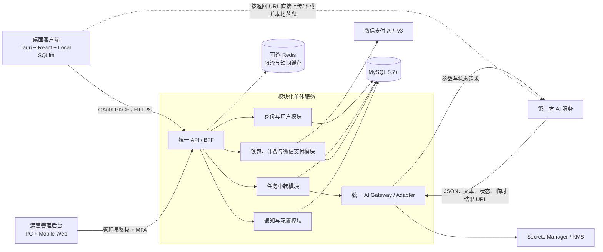
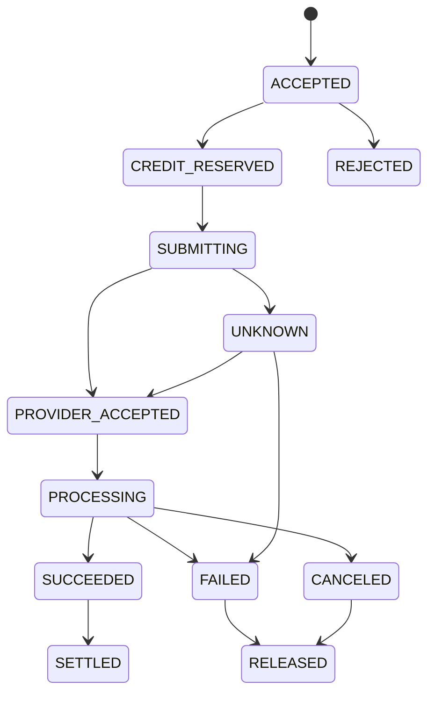

# AI Video Studio 云端平台与统一 AI 网关设计方案

> 版本：V1.0  
> 状态：按业务确认意见修订，待最终确认  
> 编写日期：2026-08-25  
> 修订日期：2026-08-26  
> 适用范围：AI Video Studio 桌面客户端、统一业务服务器、AI 网关、运营管理后台  
> 重要说明：本文是产品与技术架构方案，不替代支付、税务、隐私、生成式 AI 备案及分销业务的专项法律意见。

## 1. 执行摘要

本方案在不影响现有桌面客户端继续使用的前提下，先建设服务端和运营管理后台，待二者完整开发、联调和验收后，再迁移客户端。目标模式如下：

1. **客户端一键全自动生成能力是产品核心，不得削弱。** 用户只需输入一个剧本或一个抖音分享链接，客户端即可自动完成内容解析、分镜脚本、场景与角色图、镜头视频、视频合成和本地成片输出；服务端和管理后台均为该能力提供配置、鉴权、计费和 AI 调用支持。
2. 现有客户端在服务端和管理后台建设期间保持不动、继续可用；不得以新平台开发为由中断现有客户使用。
3. 客户端后续只访问自有业务入口，使用稳定的逻辑能力名，例如 `text.storyboard`、`image.character`、`video.shot`；第三方 API Key、真实模型和路由策略由服务端统一管理。
4. 服务端采用**模块化单体**，统一承载身份、鉴权、计费、微信支付、配置管理和 AI 请求中转；不建设独立业务微服务或服务间复杂鉴权链路。
5. 中转服务器只转发 AI 请求参数、任务状态和结果字符串，不下载、不缓存、不转码、不合成、不审核、不持久化任何任务图片、音频或视频文件。所有项目、任务结果和媒体资产只保存在客户端本地电脑。
6. 主数据库统一使用 **MySQL 5.7+**。设计、SQL 和迁移脚本不得依赖 MySQL 8.0 独有能力；生产环境可优先选择 MySQL 8.0，但兼容性基线必须是 5.7。
7. 在线支付第一阶段只接入**微信支付 API v3 Native 扫码支付**，不接入支付宝或国际卡支付。
8. 提示词模板、画风设定、生成参数预设和自动化流程配置由服务端统一下发并由管理后台维护；同时允许用户在客户端复制或覆盖默认配置，保留高级用户本地自定义能力。

### 1.1 最重要的架构决策

| 决策 | 方案 |
|---|---|
| 客户端能否完全不知道任何 API 地址 | 不能。网络客户端至少要知道一个自有服务入口。客户端不保存第三方 AI 地址；只内置自有域名，例如 `https://api.example.com`，后端迁移通过 DNS、网关和签名远程配置完成。 |
| 客户端是否保存 API Key | 不保存第三方 API Key。桌面端只保存用户登录会话，刷新令牌放入操作系统安全凭据库。 |
| 任务与文件保存在哪里 | 完整项目、任务内容、结果字符串和全部媒体文件均保存在客户端本地；服务端只保存鉴权、计费、路由、远程任务 ID、必要状态和审计元数据，不保存任务结果正文或媒体文件。 |
| AI 调用方式 | 客户端调用自有中转 API；服务端完成鉴权、额度校验和路由后，透传请求参数并在客户端查询时透传供应商状态与结果字符串。 |
| 服务端起步形态 | NestJS 模块化单体 + MySQL 5.7+ + 可选 Redis + Next.js 管理后台；AI Gateway 是单体内部模块，不独立部署为微服务。 |
| 任务一致性 | 客户端本地状态机 + 幂等键 + 云端远程任务映射；媒体结果由客户端直接下载并落盘，服务端不承担文件一致性。 |
| 计费 | 任务创建时预占额度，任务结束后按实际用量结算，多退少补；账务采用不可变双分录。 |
| 支付 | 只接微信支付 API v3 Native 扫码支付；以微信支付回调和主动查单结果作为入账依据。 |
| 配置优先级 | 客户端本地用户覆盖值 > 服务端下发的版本化默认值 > 客户端内置兜底值。服务端更新不覆盖用户已保存的本地自定义内容。 |
| 二级分销 | 技术上支持两级关系和佣金账本，但只按真实已完成订单计佣，不按人头、入门费或层级扩张计酬，上线前专项合规审查。 |

## 2. 建设目标与非目标

### 2.1 建设目标

- 把“剧本或抖音分享链接输入后自动生成本地成片”作为最高优先级能力，并持续提高自动化完成率、断点恢复能力和失败自愈能力。
- 隐藏第三方 AI 密钥、真实模型、路由和价格策略；在严格不代理媒体文件的前提下，供应商临时上传/下载域名可能出现在客户端网络链路中，不能承诺完全隐藏域名。
- 在不发布新客户端的情况下切换模型、密钥、供应商和路由权重。
- 支持文本、图片、视频理解、图片生成、视频生成等多能力、多供应商统一接入。
- 支持异步长任务、断点恢复、自动重试、取消、状态查询、客户端直连下载和本地持久化。
- 建立用户身份、余额、套餐、订单、支付、发票、退款、邀请和佣金体系。
- 建立可在 PC Web 和手机 Web 使用的响应式运营管理后台。
- 建立提示词模板、画风设定、模型参数和自动化流程预设的统一配置、版本发布、灰度和回滚能力，并保留客户端本地覆盖能力。
- 建立系统通知、公告、强制弹窗、版本升级提示和定向消息能力。
- 建立成本、质量、可用性、安全、内容治理和审计体系。

### 2.2 非目标

- 第一阶段不建设业务微服务；身份、用户、钱包、支付、任务中转、AI Gateway、配置和运营后台 BFF 均在一个模块化单体中实现。
- 客户端本地工程文件默认不全量上传云端，也不做云盘同步；云项目协作作为后续独立能力。
- 服务端不提供媒体对象存储、媒体中转落盘、视频合成、图片处理、转码、缩略图或任务结果文件托管。
- 服务端不接管客户端的一键自动化编排；自动化状态机、步骤衔接、媒体下载和最终合成仍以客户端为主。
- 不自行采集或保存银行卡号、CVV 等支付敏感数据。
- 不依赖客户端上报“支付成功”“任务完成”作为可信事实。
- 不承诺通过技术手段规避第三方模型或支付渠道的地区、内容、实名和合规限制。

## 3. 现状评估

当前代码的关键现状如下：

- 客户端：Tauri 2 + Rust + React + TypeScript。
- 本地数据：项目任务主要保存在 SQLite，生成资产保存在本地项目目录。
- AI 配置：Rust 客户端保存 `base_url`、模型名、协议类型等配置，并从系统凭据库读取 API Key。
- AI 请求：文本、图片、视频理解和视频生成由 Rust 客户端直接访问第三方接口。
- 任务恢复：客户端已有本地任务表、状态机、后台轮询和断点恢复基础。

现状的主要风险：

- 客户端二进制和运行日志可以暴露供应商地址、模型名称和业务路由。
- 即使 API Key 存在系统凭据库，客户端进程在调用时仍可读取，不能作为服务商级密钥的安全边界。
- 无法统一做用户级限流、余额校验、成本核算、供应商切换、熔断和审计。
- 供应商协议变化需要发布客户端。
- 本地任务与远程供应商任务缺少统一的云端控制面。

## 4. 总体架构



### 4.1 单体服务职责与媒体数据边界

模块化单体负责：

- 登录鉴权、用户、设备、权限。
- 余额校验、任务计费、微信支付和账务。
- 模型目录、提示词/画风配置、路由策略、价格、额度和通知。
- 将客户端任务创建、查询、取消请求映射并转发给供应商，将供应商返回的 JSON、文本、状态、远程任务 ID 和临时结果 URL 原样或按统一字段透传给客户端。
- 保存鉴权、计费、幂等、远程任务映射和审计所必需的最小元数据。

这里的“中转”只允许做平台运行必需的鉴权、额度校验、路由选择、供应商协议字段封装、状态/用量读取和结果字符串透传；不得对生成内容本身做下载、解析、加工、合成或文件持久化。统一字段封装只改变 JSON 字段名称和错误码，不改变提示词语义、不修改媒体内容、不替用户执行客户端自动化步骤。

模块化单体明确不负责：

- 不接收或保存任务结果文件，不建设 S3、MinIO 或其他对象存储。
- 不下载供应商生成的图片、音频或视频，不生成缩略图，不转码，不合成，不做媒体内容处理。
- 不把媒体二进制写入 MySQL、Redis、日志、临时目录、容器卷或服务器磁盘。
- 不长期保存完整提示词、完整供应商结果正文或结果 URL；客户端查询时实时向供应商查询并接收结果，服务端只记录状态码、用量、计费和必要审计摘要。

媒体输入输出遵循以下规则：

1. 客户端本地文件优先通过供应商支持的临时上传 URL 直接上传，或以供应商支持的 URL、Data URL、Base64 参数提交；服务端只转发相应字符串参数，不解码、不落盘。
2. 供应商返回结果 URL 后，服务端将 URL 字符串转发给客户端，由客户端下载到本地项目目录。
3. 客户端成功落盘后在本地标记完成；服务端不保存“结果文件副本”。
4. 选型时必须优先选择支持“创建任务 + 按远程任务 ID 查询 + 临时上传/下载 URL”的供应商。仅支持回调且回调后无法再次查询结果的供应商，不符合本架构。
5. 由于不建设媒体反向代理，供应商或其 CDN 的临时域名可能被客户端看到；这是“服务端不存储、不代理媒体文件”约束下的明确取舍。

### 4.2 S3 兼容对象存储的原作用与本方案结论

S3 兼容对象存储通常用于保存客户端上传的参考图片/视频、供应商生成结果、任务临时文件和导出文件，并通过预签名 URL 让客户端或供应商直接上传下载。它适合需要云端保存、跨设备访问、结果长期留存或媒体异步处理的系统。

本项目已明确：任务图片、音频、视频和结果文件全部保存在客户端电脑，中转服务器只转发参数、状态和结果字符串。因此上述能力既不需要，也会引入额外存储成本、生命周期管理、数据合规和文件一致性问题。**本期方案删除 S3/MinIO/云对象存储，不创建 Bucket，不保存任务媒体副本。**未来只有在产品单独决定建设“云端项目/跨设备同步”时，才作为独立能力重新评审，不能悄然加入当前中转链路。

## 5. 推荐技术栈

### 5.1 服务端

| 层次 | 推荐 | 理由 |
|---|---|---|
| API/BFF | NestJS + TypeScript | 与现有 TypeScript Schema 共享契约；模块化、依赖注入、Adapter 实现成本低。 |
| 任务中转 | NestJS 单体内部 `TaskRelayModule` | 负责鉴权、幂等、计费预占、供应商创建/查询/取消透传；不设置独立 Worker 服务。 |
| 主数据库 | MySQL 5.7+（生产优先 MySQL 8.0） | 使用 InnoDB 事务、唯一索引和行锁保证账务与幂等；所有功能保持 5.7 兼容。 |
| 缓存 | Redis 可选 | 仅用于限流、会话辅助和短期配置缓存；不得缓存任务媒体或完整结果，初期可单机部署且不作为业务事实来源。 |
| 管理后台 | Next.js + React + 响应式组件库 | 同时覆盖 PC Web 和手机 Web，可按 PWA 方式增强。 |
| API 契约 | OpenAPI 3.1 + 共享 TypeScript SDK | 自动生成客户端 DTO，避免 Rust/TS/服务端字段漂移。 |
| 可观测性 | OpenTelemetry + Prometheus + Grafana + Loki/Tempo | 统一日志、指标、链路和告警。 |
| 密钥管理 | 云 KMS/Secrets Manager 或 Vault | 密钥不进入数据库明文、环境文件、日志和管理后台响应。 |

### 5.2 为什么坚持模块化单体

用户、支付、钱包、邀请、计费和任务之间存在大量强事务。统一放在一个模块化单体和同一个 MySQL 数据库中，可以直接保证：

- 支付通知只入账一次。
- 任务预占额度与任务创建同时成功或同时失败。
- 退款、佣金冲正和钱包调整保持账务平衡。

模块之间通过进程内接口调用，共享同一套登录态、权限上下文、事务和审计链路，不引入服务间 Token、分布式事务、消息最终一致性和跨服务故障定位。代码仍按领域模块隔离，避免形成无法维护的“大泥球”；除非未来出现单体无法解决的明确容量瓶颈，规划期内不拆分微服务。

MySQL 5.7 兼容性约束：

- 表引擎统一使用 InnoDB，字符集统一使用 `utf8mb4`。
- 不依赖窗口函数、递归 CTE、函数索引、降序索引、`CHECK` 约束强制执行等 MySQL 8.0 独有能力。
- JSON 字段只用于低频扩展数据；需要检索、排序、唯一约束的字段必须拆成普通列并建立索引。
- UUID/ULID 对外使用字符串，库内可使用 `BINARY(16)` 或固定长度字符列；不得依赖可枚举自增 ID 作为外部 ID。
- 所有迁移和集成测试同时覆盖 MySQL 5.7 与当前生产选定版本。

### 5.3 建议仓库结构

```text
apps/
  desktop/                 # 现有 Tauri 客户端
  server/                  # NestJS 模块化单体：API、鉴权、计费、支付、配置、AI 中转
  admin-web/               # Next.js 响应式管理后台
packages/
  schemas/                 # 现有共享业务 Schema
  api-contracts/           # OpenAPI DTO、错误码、事件定义
  ai-adapter-core/         # 统一 AI Adapter 接口
  payment-adapter-core/    # 支付 Adapter 接口
  observability/           # 日志、追踪、指标公共包
infrastructure/
  docker/
  migrations/
  deployment/
```

## 6. 客户端改造方案

### 6.1 改造时机与保护原则

- 服务端和管理后台未完成开发、联调、压测与验收前，现有客户端不改调用链、不强制升级、不影响现有客户继续使用。
- 服务端以独立测试入口先行开发，通过模拟客户端和自动化契约测试验证；管理后台随后完成全部运营配置和业务闭环。
- 只有服务端与管理后台达到上线标准后，才建立客户端迁移分支并开始接入。迁移采用灰度开关，可随时回退到现有可用版本。
- 客户端迁移的目标是替换鉴权、配置和 AI 调用入口，不重写已经稳定的一键自动化编排逻辑。

### 6.2 一键全自动生成是最高优先级能力

客户端必须保留并加强以下两种单入口：

1. 用户输入剧本文本或导入剧本文件。
2. 用户粘贴抖音分享链接，由客户端提取可用内容并进入同一创作流水线。

客户端本地自动化编排器负责完整流水线：


加强要求：

- 用户确认输入和必要的安全/版权提示后，默认无需逐步骤手工点击即可运行到本地成片。
- 每一步均写入本地 SQLite 检查点；断网、退出、崩溃或单个供应商任务失败后可从失败步骤继续，不重复已完成且仍有效的步骤。
- 自动处理步骤依赖、并发、重试、降级、超时、素材复用、结果下载和本地合成；服务端只提供配置、鉴权、计费和 AI 请求中转。
- 支持“全自动模式”和“高级编辑模式”。高级用户可暂停、替换单步结果、修改提示词/画风/参数后从指定步骤继续。
- 建立端到端自动化完成率指标，并将“一次输入到本地成片成功率”列为最高级产品指标和发布阻断指标。

### 6.3 客户端保留什么

- 自有 API 网关域名或签名引导配置地址。
- OAuth 公共 `client_id`。桌面应用属于 public client，不能把 `client_secret` 放入客户端。
- 短时 Access Token。
- 放在操作系统安全凭据库中的 Refresh Token 或设备会话凭据。
- 本地项目、分集、角色、场景、分镜、任务、结果和资产文件。
- 一键全自动生成编排器、本地 SQLite 状态机、断点恢复、媒体下载和视频合成能力。
- 逻辑模型能力名、服务端默认配置缓存和用户本地覆盖配置。

### 6.4 客户端删除什么

- 第三方 AI `base_url`。
- 第三方 API Key 录入、掩码显示、清除和测试功能。
- 真实供应商模型 ID、供应商协议判断和供应商专用请求结构。
- 供应商任务查询地址和鉴权头。
- 供应商价格配置。

客户端仍可接收服务端转发的供应商临时上传/下载 URL 字符串，并使用这些地址直传或下载媒体；这不等于在客户端保存可配置的供应商 API 地址或密钥。

### 6.5 自有 API 地址的稳定策略

“客户端没有任何 API 地址”在网络上不可实现。最佳实践是：

1. 客户端只内置自有稳定域名 `api.example.com`，通过 DNS、负载均衡和 API Gateway 切换后端。
2. 可选增加 `config.example.com/client/bootstrap/v1`，下发 API 域名、最低版本、功能开关和公告公钥。
3. 引导配置使用 Ed25519 签名，客户端内置公钥并验证签名、有效期和版本回退保护。
4. 内置主/备两个自有域名作为灾难恢复入口。
5. 不建议仅依赖证书固定；如使用 SPKI Pin，必须保留主备 Pin 和远程轮换机制，避免证书更新导致全量客户端失联。

### 6.6 提示词、画风与流程配置

服务端通过版本化配置接口下发：

- 提示词模板：剧本分析、角色提取、场景提取、分镜、图片、视频、配音和字幕等模板。
- 画风设定：名称、说明、预览信息、正向/负向描述、推荐模型与参数约束。
- 生成参数预设：画幅、分辨率、时长、质量、镜头节奏、随机性和并发建议。
- 自动化流程预设：步骤是否启用、步骤依赖、默认重试次数、超时、降级策略和人工确认点。

配置采用不可覆盖用户修改的三层合并规则：

1. **客户端本地用户覆盖值**：优先级最高，只存本地，可导入/导出、恢复默认。
2. **服务端版本化默认值**：由管理后台发布，支持草稿、预览、灰度、正式发布和回滚。
3. **客户端内置兜底值**：仅在首次启动或服务端不可用且本地无缓存时使用。

每个本地覆盖记录保存 `base_config_id`、`base_version`、`override_fields` 和更新时间。服务端发布新版本时，客户端只更新未被用户覆盖的字段；对已覆盖字段显示“默认版本已更新”，由用户选择继续保留、查看差异或恢复新版默认值。服务端不上传、读取或改写用户本地自定义提示词，除非用户主动选择同步功能；第一阶段不建设该同步功能。

### 6.7 本地任务表建议字段

| 字段 | 用途 |
|---|---|
| `local_task_id` | 客户端生成的 UUID，永不改变。 |
| `cloud_task_id` | 服务端任务 ID，可为空。 |
| `idempotency_key` | 创建任务时的幂等键。 |
| `task_type` | 逻辑任务类型。 |
| `request_snapshot_json` | 本地完整请求快照。 |
| `request_hash` | 服务端校验重放参数是否一致。 |
| `local_status` | 本地排队、上传、同步、完成状态。 |
| `cloud_status` | 最近一次服务端状态。 |
| `server_revision` | 服务端单调递增版本。 |
| `progress` / `stage` | 进度和阶段。 |
| `usage_json` / `cost_snapshot_json` | 用量和计费快照。 |
| `result_json` | 服务端返回的结构化结果。 |
| `result_local_paths_json` | 客户端下载后的本地媒体路径。 |
| `pipeline_run_id` / `parent_task_id` | 关联一键自动化运行和上下游步骤。 |
| `config_snapshot_json` | 本次运行实际使用的服务端默认值与本地覆盖合并快照。 |
| `last_synced_at` | 最近同步时间。 |
| `retry_count` / `next_retry_at` | 本地同步重试。 |

另建 `sync_outbox` 表保存待发送动作。写入本地任务和 Outbox 必须在同一个 SQLite 事务内完成。

### 6.8 本地与云端一致性

采用“本地完整记录、云端执行权威”的双层模型：

- 项目内容、完整提示词、可编辑结果和媒体文件：只以客户端本地为主。
- 用户余额、支付、任务是否获得执行资格、供应商执行状态和最终计费：服务端为主。
- 每个写请求都携带 `Idempotency-Key`、`local_task_id` 和请求哈希。
- 客户端重复提交相同键时，服务端返回原任务；相同键但参数不同则拒绝。
- 状态查询支持单任务和批量 ID；服务端实时查询供应商后透传状态与结果字符串，不保存结果文件或完整结果正文。
- 服务端最小状态使用 `revision` 单调增长；客户端只接受更高版本，避免乱序覆盖。
- 客户端离线时任务进入 `PENDING_SYNC`；恢复网络后 Outbox 重放。
- 客户端完成媒体下载后在本地保存结果；供应商临时 URL 失效前若下载失败，客户端通过服务端重新查询供应商获取可用结果字符串。
- 服务端仅按法定、财务和安全要求保留账务、支付、用量、审计及必要任务元数据，不保留任务媒体与结果正文。

## 7. 统一 AI Gateway

### 7.1 客户端使用逻辑能力，不使用真实模型名

示例逻辑能力：

- `text.outline`
- `text.episodes`
- `text.assets.extract`
- `text.storyboard`
- `video.understand`
- `image.character`
- `image.character_state`
- `image.scene`
- `image.storyboard`
- `video.shot`

逻辑能力由服务端映射到真实供应商和模型。客户端只获得可选能力、展示名称、参数约束和计价单位，不获得供应商密钥或内部路由。

### 7.2 Adapter 接口

```ts
export interface AiProviderAdapter {
  readonly providerType: string;
  capabilities(): AiCapability[];
  validate(input: NormalizedAiRequest, model: ModelRuntimeConfig): void;
  estimate(input: NormalizedAiRequest, model: ModelRuntimeConfig): UsageEstimate;
  create(input: NormalizedAiRequest, context: AdapterContext): Promise<ProviderCreateResult>;
  query?(remoteTaskId: string, context: AdapterContext): Promise<ProviderTaskResult>;
  cancel?(remoteTaskId: string, context: AdapterContext): Promise<void>;
  normalizeError(error: unknown): UnifiedAiError;
  healthCheck(context: AdapterContext): Promise<ProviderHealth>;
}
```

一个新供应商的接入步骤应固定为：

1. 新建 Adapter，实现能力、请求映射、响应解析、错误归一化和健康检查。
2. 在模型目录注册供应商模型及参数 Schema。
3. 在密钥管理中创建凭据引用。
4. 配置路由策略、价格和并发限制。
5. 通过契约测试、沙箱测试、故障注入和小流量灰度。
6. 管理后台启用，无需发布客户端。

### 7.3 服务端核心模块

- `Model Registry`：供应商、模型、能力、上下文限制、分辨率、时长、参考图数量等。
- `Credential Registry`：只保存密钥引用、版本、状态、用途、配额和最后验证时间。
- `Routing Engine`：按能力、地区、价格、健康度、用户套餐、灰度组和容量选择路由。
- `Adapter Runtime`：执行请求字段映射、创建、查询、取消和结果字符串字段统一；不下载、解码或处理媒体。
- `Usage Meter`：记录 token、图片张数、视频秒数、分辨率等供应商计费元数据，不计量平台媒体存储和媒体中转带宽。
- `Pricing Engine`：按版本化价格表计算预估、预占和实际费用。
- `Policy Engine`：额度、并发、内容策略、模型白名单、用户等级和地区限制。
- `Reliability Layer`：超时、指数退避、抖动、熔断、限流、隔离舱和降级。

### 7.4 路由策略

路由应支持：

- 固定主路由 + 备用路由。
- 按权重分流。
- 按用户套餐、地区、任务类型和模型能力路由。
- 按实时成功率、P95 延迟、429 比例和余额自动摘除。
- 同一任务重试优先保持供应商一致；确认供应商没有创建任务后才允许跨供应商重试。
- 生成结果可能不同的任务不能无条件自动跨模型重试，必须记录 `attempt` 和用户可见原因。
- 支持金丝雀、影子流量和一键熔断。

### 7.5 统一错误模型

```json
{
  "code": "AI_PROVIDER_RATE_LIMITED",
  "message": "当前服务繁忙，系统将自动重试",
  "retryable": true,
  "retry_after_ms": 5000,
  "task_id": "task_xxx",
  "request_id": "req_xxx",
  "details": {
    "stage": "provider_create"
  }
}
```

供应商原始错误只写入受控日志并脱敏，不直接返回客户端。客户端错误文案不应暴露供应商、内部 URL、密钥编号或路由策略。

## 8. 任务中转系统

### 8.1 服务端最小状态机

客户端的一键自动化流水线状态机不迁移到服务端。服务端只为每个 AI 子任务维护鉴权、计费和远程任务映射所需的最小状态：



### 8.2 任务创建流程

1. 客户端自动化编排器为当前 AI 子步骤生成 `local_task_id` 和 `Idempotency-Key`，调用服务端创建接口。
2. 服务端校验 Access Token、设备、客户端版本、幂等键、请求哈希、逻辑能力、套餐、并发和余额。
3. 服务端估算最大费用，并在同一 MySQL 事务中写入最小任务记录、幂等记录和余额预占。
4. 单体内的 AI Gateway 选择供应商与密钥，把请求参数映射后直接提交给供应商，不写内部任务队列，不保存请求中的媒体内容。
5. 服务端保存 `cloud_task_id`、受控的远程任务 ID、路由 ID、用量和计费元数据，并把供应商的创建结果字符串转发给客户端。
6. 客户端按退避策略调用单任务或批量查询接口；服务端收到每次查询后实时调用供应商查询接口，把状态、进度、错误和结果 URL 等结果字符串转发给客户端。
7. 供应商成功后，服务端根据可信的供应商状态/用量完成结算；客户端根据结果 URL 直接下载媒体并保存到本地项目目录。
8. 服务端不下载、不暂存、不备份结果文件，也不保存完整结果正文；客户端本地状态机决定何时进入下一自动化步骤。

同步文本模型可在一次 HTTP 请求内返回结果字符串；服务端在完成鉴权、计费和必要字段映射后直接返回，不持久化文本正文。若任务创建请求包含较大的 Base64/Data URL 参数，应设置严格请求上限并优先改用供应商临时直传 URL，避免单体 API 内存和带宽被占满。

### 8.3 重试原则

- 网络连接在“供应商是否已创建任务”不明确时，先用供应商幂等键或查询接口确认，不能直接重复创建。
- 429、5xx 和瞬时网络错误可自动重试；参数、内容审核、余额不足不可自动重试。
- 查询重试主要由客户端编排器采用指数退避 + 随机抖动执行；服务端只对一次转发请求中的安全瞬时错误做有限重试。
- 每次尝试写入 `task_attempts`，记录路由、密钥版本、时间、错误分类和用量。
- 手动重试生成新 attempt，但保留原任务链路和计费冲正关系。

## 9. 用户、登录与鉴权

### 9.1 用户能力

- 手机号验证码注册/登录。
- 邮箱注册/登录和邮箱验证。
- 密码登录、找回密码、密码泄露检查和弱密码阻止。
- 可选微信、Apple、Google 等联合登录。
- 设备列表、会话列表、远程下线、异常登录提醒。
- 注销账户、数据导出、隐私授权管理。
- 实名状态作为独立可选能力，不与普通登录字段混在一起。
- 团队/组织、成员、席位和企业套餐作为后续扩展。

### 9.2 桌面端 OAuth

- 使用 Authorization Code + PKCE S256。
- 禁用 Implicit Grant 和 Resource Owner Password Grant。
- Access Token 短时有效，建议 5～15 分钟。
- Refresh Token 轮换并检测重放；被重放时撤销整个令牌族。
- Access Token 限定 `audience` 和最小 Scope。
- 桌面端回调使用系统浏览器 + loopback redirect 或已注册的 HTTPS App Link。
- Refresh Token 保存到 Windows Credential Manager/macOS Keychain/Linux Secret Service。
- 高风险操作要求重新认证；管理员强制 MFA，优先 WebAuthn/TOTP。

OAuth 安全基线遵循 [RFC 9700](https://www.rfc-editor.org/rfc/rfc9700.html) 和原生应用 [RFC 8252](https://www.rfc-editor.org/rfc/rfc8252.html)。

### 9.3 权限模型

用户侧采用 Scope + 资源归属校验；管理后台采用 RBAC，并为以下高风险操作增加双人复核：

- 新增或显示供应商密钥。
- 修改价格和赠送额度。
- 大额退款、余额调整、佣金提现。
- 关闭内容策略、绕过审核。
- 导出用户或财务数据。

## 10. 钱包、计费与套餐

### 10.1 不可变双分录账本

余额不能只保存在 `users.balance`。建议使用：

- `ledger_accounts`：用户可用余额、预占余额、平台收入、赠送额度、佣金等账户。
- `ledger_transactions`：一次业务交易的头信息。
- `ledger_entries`：借方/贷方分录，所有分录之和必须为零。
- `credit_holds`：任务预占、过期和释放。
- `pricing_versions`：价格版本与生效时间。

金额和点数使用最小单位整数或高精度 Decimal，禁止使用浮点数。

### 10.2 任务计费

- 文本：输入/输出 token、缓存 token、工具调用。
- 图片：张数、尺寸、质量、编辑/生成类型。
- 视频理解：时长、分辨率和供应商计费单位。
- 视频生成：秒数、分辨率、版本、参考图数量。
- 平台服务费：可作为独立价格项，不混入供应商成本字段。

创建任务时保存 `pricing_snapshot`，后续调价不能改变历史任务费用。

### 10.3 套餐与配额

- 充值余额。
- 月度/年度订阅。
- 套餐赠送额度和有效期。
- 并发数、每日额度、模型等级、排队优先级。
- 优惠券、兑换码、活动赠送。
- 企业共享额度池。
- 余额不足提醒和自动充值可作为后续能力。

## 11. 在线支付

### 11.1 支付渠道

- 第一阶段唯一在线支付渠道为**微信支付 API v3 Native 扫码支付**。
- 服务端调用 `POST /v3/pay/transactions/native` 创建预支付订单，取得 `code_url`。
- 客户端或管理后台前端根据 `code_url` 在本地渲染二维码，不在服务端保存二维码图片。
- 用户使用微信“扫一扫”付款；服务端接收微信支付异步通知，并以主动查单作为异常补偿。
- 支持超时关单、申请退款、退款查询和账单对账。
- 本阶段不接入支付宝、Stripe、银行卡或聚合支付；未来新增渠道必须重新评审，不作为本次建设范围。

单体内部实现 `WechatNativePayService`，不为尚未确定的支付渠道提前拆分独立微服务：

```ts
export interface WechatNativePayService {
  createNativeOrder(order: PaymentOrder): Promise<{ codeUrl: string; expiresAt: string }>;
  queryOrder(outTradeNo: string): Promise<PaymentStatus>;
  refund(input: RefundRequest): Promise<RefundResult>;
  verifyAndDecryptNotification(rawBody: Buffer, headers: Record<string, string>): VerifiedPaymentEvent;
  closeOrder(outTradeNo: string): Promise<void>;
}
```

微信支付官方 Native 下单接口返回用于生成扫码支付二维码的 `code_url`，参见[微信支付 Native 下单文档](https://pay.wechatpay.cn/doc/v3/merchant/4012791877)。

### 11.2 支付正确性规则

- 客户端“我已支付”按钮和支付完成页面只触发查单或展示，不是入账依据。
- 服务器必须按照微信支付 API v3 规则验证通知签名并解密通知资源，校验商户号、应用号、商户订单号、微信支付订单号、金额、币种和交易状态。
- 通知保存原始报文哈希、通知 ID、签名结果和处理状态；敏感报文按最小必要原则加密和限权。
- 同一个通知 ID、微信支付订单号和商户订单号只能入账一次，依靠 MySQL 唯一索引和事务保证。
- 支付通知接口快速返回成功应答；账务入账在同一单体内通过本地 Outbox 可靠处理，不引入跨微服务事务。
- 定时主动查询“用户已扫码但通知未处理”的订单；每日下载微信支付账单并对账，差异进入人工处理队列。
- 退款、拒付、撤销必须产生反向账务分录，不能修改历史分录。
- 微信商户 API 私钥、API v3 密钥和平台公钥/证书必须进入 Secrets Manager/KMS/Vault，严禁进入源码、日志或管理后台明文响应。

## 12. 邀请与二级分销

### 12.1 功能模型

- 每个用户有唯一邀请码和分享链接。
- 注册时绑定一级邀请人，绑定后原则上不可随意变更。
- 保存一级和二级关系快照，订单计佣时以订单发生时规则为准。
- 佣金经历 `PENDING`、`FROZEN`、`AVAILABLE`、`WITHDRAWING`、`PAID`、`REVERSED`。
- 退款、拒付或作弊订单自动冲正佣金。
- 支持最低提现额、结算周期、税务信息、人工复核和提现手续费。

### 12.2 风控

- 禁止自邀、同支付账户互邀、批量设备、虚拟号和异常 IP 集群。
- 邀请奖励只基于真实完成且超过退款观察期的消费订单。
- 设置单用户、单设备、单支付账户和活动总预算上限。
- 高风险佣金延长冻结期并进入人工审核。

### 12.3 合规红线

“二级分销”在中国大陆具有较高合规风险。技术方案不应支持：

- 以缴纳费用或购买资格包作为加入/发展下线条件。
- 按发展人员数量计酬。
- 形成上下线后，以间接发展人员的层级扩张作为主要报酬依据。
- 多层无限级扩张。

《禁止传销条例》对以直接或间接发展人数、销售业绩以及入门费等方式牟利作出明确规定，参见[国家行政法规库](https://xzfg.moj.gov.cn/front/law/detail?LawID=148&Query=)。上线前必须由熟悉互联网分销、税务和支付结算的律师出具专项意见；如风险不可接受，降级为“单级邀请返利”。

## 13. 通知与公告

### 13.1 通知类型

- 系统公告、维护通知、服务故障。
- 任务完成、失败、余额不足、支付和退款。
- 版本升级、强制升级、功能灰度。
- 活动、优惠券、邀请和佣金。
- 风险登录、密码修改、设备下线。

### 13.2 投放能力

- 全量、用户、角色、套餐、地区、客户端版本、灰度组和标签定向。
- 定时发布、过期、撤回、置顶和多语言。
- 普通消息、重要消息、强制确认弹窗。
- Markdown/富文本、图片、按钮和客户端 Deep Link。
- 已送达、已读、已确认和点击统计。
- 客户端通过增量游标同步；在线时可用 SSE 提醒，SSE 断开不影响消息最终送达。

## 14. 管理后台

管理后台使用响应式 Web，覆盖 PC 和手机浏览器。建议模块：

### 14.1 运营

- 用户查询、状态、标签、套餐、设备和登录历史。
- 公告、消息模板、定向投放和效果统计。
- 优惠券、兑换码、活动和功能开关。
- 客服工单、用户申诉和内容举报。

### 14.2 AI 运营

- 供应商与 Adapter 状态。
- 模型目录、能力参数、逻辑模型别名。
- API Key 引用、有效性、额度、轮换和停用；后台永不回显完整 Key。
- 路由权重、备用路由、灰度、熔断和限流。
- 实时成功率、延迟、429/5xx、任务积压和单位成本。
- 提示词模板分类、编辑、变量 Schema、版本、预览、灰度发布、正式发布、回滚和 A/B 测试。
- 画风设定、预览信息、正负向描述、适用能力、推荐模型和参数边界。
- 生成参数预设和自动化流程预设，包括步骤开关、依赖、重试、超时、降级和人工确认点。
- 配置发布影响范围和客户端最低版本校验；不得强制覆盖客户端用户已有的本地自定义值。
- 一键自动化漏斗：输入解析、分镜、角色/场景图、镜头视频、下载、合成各阶段成功率，以及从一次输入到本地成片的端到端完成率。

### 14.3 财务

- 订单、支付、退款、拒付和渠道对账。
- 钱包流水、预占、结算和人工调整。
- 套餐、价格版本和供应商成本。
- 邀请关系、佣金、冻结、冲正和提现审核。
- 发票申请和财务导出。

### 14.4 安全与审计

- 管理员、角色、权限和数据范围。
- MFA、登录限制、IP/设备策略。
- 不可变管理操作审计。
- 密钥访问、价格修改、余额调整和数据导出专项审计。
- 风险事件、封禁、申诉和恢复。

## 15. 核心数据模型

| 领域 | 核心表 |
|---|---|
| 身份 | `users`, `user_identities`, `user_profiles`, `devices`, `sessions`, `refresh_token_families`, `consents` |
| 权限 | `roles`, `permissions`, `role_permissions`, `admin_users`, `admin_role_bindings` |
| 任务 | `ai_tasks`, `task_attempts`, `task_events`, `idempotency_records`, `outbox_events`；仅保存最小任务元数据，不设任务媒体文件表 |
| AI | `providers`, `provider_credentials`, `models`, `model_capabilities`, `logical_models`, `routing_policies` |
| 统一配置 | `config_sets`, `config_versions`, `prompt_templates`, `style_presets`, `generation_presets`, `pipeline_presets`, `config_releases` |
| 计量 | `usage_records`, `provider_cost_records`, `pricing_versions`, `price_items` |
| 钱包 | `ledger_accounts`, `ledger_transactions`, `ledger_entries`, `credit_holds` |
| 支付 | `payment_orders`, `payment_attempts`, `payment_webhook_events`, `refunds`, `reconciliation_batches` |
| 套餐 | `plans`, `subscriptions`, `entitlements`, `coupons`, `redemptions` |
| 邀请 | `referral_codes`, `referral_relations`, `commission_rules`, `commissions`, `withdrawals` |
| 通知 | `announcements`, `notification_campaigns`, `notification_deliveries`, `notification_receipts`, `templates` |
| 安全 | `audit_logs`, `risk_events`, `content_moderation_records`, `data_export_jobs`, `deletion_requests` |

关键约束：

- 所有业务表使用 UUID/ULID，不使用可枚举自增 ID 暴露给客户端。
- 多租户扩展字段 `tenant_id` 从第一版预留。
- 任务、支付、账务、佣金和通知事件使用 UTC 时间；展示层转换时区。
- 账务和审计记录不可物理修改，只能追加冲正或更正记录。
- 敏感字段分类、加密，并限制管理员数据范围。
- `ai_tasks` 不得包含 BLOB、媒体 Base64、完整结果正文或服务器本地文件路径；结果 URL 只在请求链路中透传，不作为任务结果长期保存。
- MySQL 5.7 不可靠执行的业务约束由应用层校验、唯一索引、外键和事务共同保证；上线前用并发集成测试验证幂等、扣费和支付入账。

## 16. 客户端统一 API 草案

### 16.1 基础约定

- Base URL：`https://api.example.com/api/v1`
- 鉴权：`Authorization: Bearer <access_token>`
- 幂等：所有有副作用的 POST 接受 `Idempotency-Key`
- 追踪：`X-Request-ID`
- 客户端：`X-Client-Version`、`X-Platform`、`X-Device-ID`
- 时间：RFC 3339 UTC
- 分页：Cursor，不使用易漂移的 Offset

### 16.2 任务接口

```http
POST /tasks
GET  /tasks/{task_id}
POST /tasks/status:batch-get
POST /tasks/{task_id}:cancel
POST /tasks/{task_id}:retry
```

任务创建示例：

```json
{
  "local_task_id": "0198...",
  "task_type": "image.character_state",
  "logical_model": "image.standard",
  "input": {
    "prompt": "...",
    "media_inputs": [
      {
        "type": "provider_upload_token",
        "value": "temporary-upload-reference"
      }
    ]
  },
  "parameters": {
    "aspect_ratio": "9:16",
    "quality": "standard"
  },
  "client_context": {
    "project_id": "local-project-id",
    "target_type": "character_state",
    "target_id": "state-id"
  }
}
```

返回：

```json
{
  "task_id": "task_...",
  "local_task_id": "0198...",
  "status": "QUEUED",
  "revision": 1,
  "estimated_credits": 2,
  "reserved_credits": 2,
  "created_at": "2026-08-25T08:00:00Z"
}
```

任务查询成功时，响应可包含供应商返回的文本、结构化 JSON 字符串或临时媒体 URL。服务端不把这些结果写入媒体存储或任务结果正文表；客户端收到后立即写入本地任务记录，并直接下载媒体。

### 16.3 媒体直传辅助接口

```http
POST /media-transfers:prepare
```

该接口只在供应商支持临时直传凭据时使用。服务端选择路由并向供应商申请临时上传信息，然后把 `upload_url`、限定 Header、临时 Token、过期时间和供应商上传引用作为字符串转发给客户端。客户端直接上传给供应商；服务端不接收文件、不创建 Bucket、不保存对象键。若供应商不支持安全的临时直传，可按接口限制使用 Data URL/Base64 参数透传，但不得在服务端解码或落盘，且必须限制请求大小。

### 16.4 配置接口

```http
GET /client-config/bootstrap
GET /client-config/releases/current?client_version=...
GET /client-config/prompt-templates
GET /client-config/style-presets
GET /client-config/generation-presets
GET /client-config/pipeline-presets
```

响应包含配置 ID、版本、校验和、生效范围和字段 Schema。客户端缓存服务端默认值并与本地覆盖合并；客户端本地自定义值默认不上传。

### 16.5 用户和账务接口

```http
GET  /me
GET  /me/devices
DELETE /me/devices/{device_id}
GET  /wallet
GET  /wallet/transactions
GET  /plans
POST /payments/wechat/native
GET  /payments/{order_id}
POST /payments/{order_id}:close
POST /refunds
GET  /referrals/summary
GET  /commissions
GET  /notifications/changes?cursor=...
POST /notifications/{id}:read
```

## 17. 安全设计

### 17.1 供应商密钥

- 密钥只进入 Secrets Manager/KMS/Vault，不进入源码、Docker 镜像、普通环境文件和数据库明文。
- 数据库只保存 `secret_ref`、掩码、版本、状态和元数据。
- 单体内的 Adapter Runtime 按最小权限短时读取。
- 支持新旧密钥并行、金丝雀验证、无停机轮换和紧急吊销。
- 严禁把密钥写入请求日志、异常、Tracing attributes 和管理后台响应。
- Vault 可用于集中密钥、轮换和审计；Transit 支持应用侧信封加密和密钥版本轮换，参见 [Vault Transit](https://developer.hashicorp.com/vault/docs/secrets/transit)。

### 17.2 API 安全

- TLS 1.2+，优先 TLS 1.3。
- WAF、DDoS 防护、Bot 防护和分层限流。
- 用户、设备、IP、任务类型、模型和供应商多维限流。
- DTO 白名单验证、请求体大小限制、压缩炸弹防护和 MIME 嗅探。
- 任务创建、查询和取消均校验用户归属；供应商临时上传/下载信息只返回给任务所有者，并设置最短可用有效期。
- 管理后台与用户 API 分域、分 Scope；后台可增加 Zero Trust/VPN/IP 策略。
- 依赖漏洞扫描、SBOM、镜像签名、SAST/DAST 和密钥扫描进入 CI。
- 安全验收参考 [OWASP ASVS](https://cheatsheetseries.owasp.org/IndexASVS.html)。

### 17.3 内容与媒体参数安全

- 客户端在本地对待上传文件做扩展名、MIME、魔数、大小和媒体解码校验；服务端只校验参数 Schema、字符串长度和允许的 URL/引用类型。
- 服务端禁止把 Base64/Data URL、结果 URL 或媒体二进制写入请求日志、Tracing、MySQL、Redis、异常报告和临时文件。
- Office/PDF 等文档由客户端按不可信输入隔离解析；服务端不接收或解析此类文件。
- 对请求中的文本参数执行必要的合规规则并使用供应商内容安全能力；服务端不下载生成媒体进行二次审核。客户端对本地成片承担展示提示、举报和必要的本地安全检查。
- 防止 Prompt Injection 影响系统工具；模型输出不能直接执行系统命令或访问任意 URL。
- 对服务端允许抓取的 URL 做 SSRF 防护：域名白名单、DNS 重绑定防护、禁止内网和元数据地址。

## 18. 隐私、AI 与分销合规

### 18.1 隐私与数据

- 制定隐私政策、用户协议、第三方共享清单、SDK 清单和数据保留表。
- 按最小必要原则收集；分别记录合同必要、同意、单独同意等处理基础。
- 提供查阅、复制、更正、删除、撤回同意、注销和数据导出入口。
- 提示词、人物图片、声音和视频可能包含敏感个人信息，上传前需明确告知用途和接收方类别。
- 调用境外模型可能构成个人信息跨境提供，必须在路由前完成数据分类、去标识化和适用的跨境合规流程。
- 日志默认不记录完整提示词、媒体 URL、令牌、手机号和身份证件。

《个人信息保护法》要求明确告知处理目的、方式、种类和保存期限，并规定个人权利及跨境条件，参见[中国人大网全文](https://www.npc.gov.cn/WZWSREL25wYy9jMi9jMzA4MzQvMjAyMTA4L3QyMDIxMDgyMF8zMTMwODguaHRtbD9yZWY9aW1i)。《网络数据安全管理条例》要求建立制度并采取加密、备份、访问控制和安全认证等措施，参见[中国政府网](https://app.www.gov.cn/govdata/gov/202409/30/520076/article.html)。

### 18.2 生成式 AI 与深度合成

- 在公开提供服务前评估生成式 AI 服务备案、安全评估、算法备案和 APP/ICP 备案要求。
- 建立输入输出内容治理、违法不良信息处置、用户举报、申诉和人工审核。
- 对 AI 生成图片和视频保留生成来源、模型版本、任务 ID 和可验证元数据。
- 根据适用法规增加显式/隐式 AI 生成标识，避免移除供应商或法规要求的标识。
- 涉及人脸、声音和真实人物形象时增加授权确认和滥用检测。
- 如提供公开发布能力，评估实名要求；纯本地创作工具与公开信息发布平台的义务可能不同。

参考：[《互联网信息服务深度合成管理规定》](https://www.cac.gov.cn/2022-12/11/c_1672221949354811.htm)、[《互联网信息服务算法推荐管理规定》](https://www.cac.gov.cn/2022-01/04/c_1642894606364259.htm)。

## 19. 可观测性与运营指标

所有请求贯穿 `request_id`、`user_id_hash`、`task_id`、`attempt_id`、`route_id` 和 `provider_request_id`。使用 OpenTelemetry 统一采集 traces、metrics、logs；OpenTelemetry 是厂商中立的可观测框架，参见[官方文档](https://opentelemetry.io/docs/)。

### 19.1 必须监控的指标

- API 成功率、P50/P95/P99、认证失败、限流和版本分布。
- 任务创建/查询中转成功率、P95/P99、供应商请求并发、超时和连接池使用率。
- 按供应商/模型/密钥的成功率、429、5xx、延迟和熔断状态。
- 任务创建到首进度、创建到完成的端到端耗时。
- 客户端匿名聚合的一键流水线阶段完成率、断点恢复成功率、无需人工干预完成率和“一次输入到本地成片”成功率；不得上报剧本、提示词或媒体内容。
- 预估用量与实际用量偏差、单位任务毛利和供应商成本。
- 支付回调延迟、重复事件、对账差异和退款率。
- 余额负数、账本不平、佣金异常和人工调整。
- 通知送达率、已读率和客户端版本覆盖。

### 19.2 初始 SLO 建议

- 任务创建/查询 API 月可用性：99.9%。
- 不含供应商响应等待时间的任务创建服务端处理 P95：500 ms 内。
- 不含供应商查询耗时的任务状态查询服务端处理 P95：200 ms 内，并单独监控供应商端到端延迟。
- 支付回调接收可用性：99.99%，先持久化再异步处理。
- MySQL：RPO 不高于 5 分钟，RTO 不高于 30 分钟；按实际预算调整。
- 服务端媒体文件存储量：始终为 0；通过磁盘、临时目录、数据库大字段和 Redis 大 Key 巡检持续验证。

## 20. 部署与灾难恢复

### 20.1 第一阶段生产部署

- 国内合规云区域部署模块化单体、MySQL 5.7+、可选 Redis 和管理后台静态资源；不部署任务对象存储或媒体处理节点。
- 模块化单体至少两个无状态实例跨可用区，通过负载均衡对外服务；所有实例运行相同代码和模块，不拆业务微服务。
- 通过 HTTP 连接池、供应商级并发隔离、限流和超时控制隔离文本、图片、视频供应商调用，但不建立独立 Worker 队列。
- MySQL 使用托管高可用、自动备份和 PITR；迁移脚本保持 MySQL 5.7 兼容。Redis 如启用则使用高可用托管实例，但不保存业务唯一事实。
- 服务器数据盘、容器卷和临时目录设置媒体文件巡检与容量告警，确保任务图片、音频、视频和完整结果正文不落盘。
- 管理后台独立域名，WAF + MFA + 严格 CSP。
- Secrets Manager/KMS 使用工作负载身份，不分发长期云密钥。

### 20.2 单体扩容原则

优先通过以下方式扩展，不改变单体边界：

- 水平增加相同的单体实例，并通过负载均衡分流。
- 按供应商、用户和逻辑能力设置连接池、并发舱壁、超时、限流与熔断。
- 优化 MySQL 索引、读写路径和连接池；报表使用只读副本或离线导出，避免影响在线事务。
- 管理后台前端静态部署不视为业务微服务；它始终通过同一个单体 API 访问业务数据。

Kubernetes 不是首期必需项。只有现有部署方式已出现有数据支撑且无法通过纵向/横向扩容解决的瓶颈时才评估；评估 Kubernetes 也不等于拆分微服务。任何服务拆分必须单独立项，证明收益大于鉴权、事务一致性、运维和排障成本。

### 20.3 灾备

- 数据库 PITR、每日快照和定期异地恢复演练。
- 账务表额外做不可变归档和校验和。
- 密钥恢复、轮换和紧急吊销 Runbook。
- 供应商全故障时，客户端自动化流水线在本地暂停并保留检查点；恢复后从未完成步骤继续。服务端提供停服、拒绝新任务、释放预占、退款和公告预案。
- 服务端灾备不包含任务媒体恢复；媒体与项目恢复责任在客户端本地备份策略中明确告知用户。
- 每季度执行恢复演练，不以“备份成功”代替“恢复成功”。

## 21. 建议补充的产品能力

用户原始设想之外，建议纳入路线图：

1. 套餐订阅、优惠券、兑换码、退款和发票。
2. 团队/组织、席位、共享额度和企业账单。
3. 客户端版本管理、灰度发布、强制升级和远程功能开关。
4. 服务状态页、故障公告和供应商降级通知。
5. 用户工单、申诉、内容举报和客服备注。
6. 成本预算、供应商额度预警、毛利保护和自动熔断。
7. Prompt 版本管理、灰度、A/B 测试和回滚。
8. 模型质量评测集、自动回归、人工评分和供应商对比。
9. 数据导出、账户注销、隐私同意版本和保留策略。
10. 内容审核、AI 标识、授权证明和生成溯源。
11. 风险控制：设备指纹、异常注册、支付欺诈、撞库和佣金作弊。
12. 操作审计、双人复核、财务对账和税务资料。
13. 多语言、多时区预留；本阶段币种固定为人民币，支付只使用微信 Native 扫码支付。
14. 企业 API Key：这是客户调用“你的平台”的 Key，与供应商 Key 完全隔离，并具备 Scope、额度和 IP 限制。
15. 客户端本地项目备份、迁移和存储空间检查，降低“服务端不保存媒体文件”前提下的本地数据丢失风险。
16. 一键自动化质量看板、失败样本分类、断点恢复演练和从剧本/抖音链接到成片的回归测试集。

## 22. 分阶段实施路线

总原则：**Phase 0～6 期间不修改现有客户端生产调用链，现有客户继续使用当前可用版本。只有服务端和管理后台全部完成并通过 Phase 6 验收门禁后，才开始 Phase 7 客户端迁移。**

### Phase 0：范围冻结与兼容基线（1～2 周）

- 冻结统一任务、错误、用量和价格契约。
- 建立 `api-contracts` 包和 OpenAPI。
- 盘点客户端所有第三方请求点、模型协议和本地任务表。
- 确定域名、环境、云厂商、MySQL 版本、密钥管理和部署方式。
- 冻结“服务端零任务媒体文件”“模块化单体”“MySQL 5.7+”“微信 Native 扫码支付”和“客户端一键自动化不得削弱”五项架构红线。

验收：形成完整调用清单和迁移映射，不遗漏文本、图片、视频理解、视频生成、任务查询、提示词/画风配置以及剧本/抖音链接两种一键入口。

### Phase 1：模块化单体基础（2～4 周）

- 建立 NestJS 单体工程及身份、用户、权限、审计、配置、任务、计费、支付等模块边界。
- 完成用户注册、登录、PKCE 服务端能力、令牌轮换、设备和会话 API。
- 完成统一错误、请求 ID、限流、Secrets 管理和审计。
- 完成 MySQL 5.7/8.0 双版本迁移与集成测试；不开发客户端登录 UI。

验收：使用模拟客户端/接口测试工具完成身份与基础 API 全流程；MySQL 5.7 全部测试通过；现有客户端无变更。

### Phase 2：统一 AI 中转与配置中心（3～5 周）

- 先接现有供应商，完成文本、图片、视频理解、视频生成 Adapter。
- 模型目录、密钥引用、逻辑模型和固定主备路由。
- 服务端任务创建、查询、取消、幂等、预占、结算和供应商结果字符串透传。
- 完成供应商临时直传信息透传、客户端直传/直下模拟测试；不建设 Worker、任务队列和对象存储。
- 完成提示词模板、画风、生成参数和自动化流程预设的版本化配置 API。

验收：测试客户端可通过服务端完成现有 AI 能力的创建与查询；服务端磁盘、MySQL、Redis、日志均无任务媒体或完整结果正文；供应商 Key 不下发。

### Phase 3：钱包、计费与微信扫码支付（3～5 周）

- 完成双分录账本、预占/结算、价格版本、套餐和用量记录。
- 接入微信支付 API v3 Native 下单，前端根据 `code_url` 渲染二维码。
- 完成支付通知验签/解密、主动查单、关单、退款、账单下载、对账和财务审计。

验收：重复通知、乱序、超时、主动查单补偿、退款和对账差异均通过自动化测试；不依赖客户端声称“支付成功”入账。

### Phase 4：运营管理后台与通知（3～5 周）

- 完成用户、任务元数据、供应商、模型、密钥、路由、钱包、订单、微信支付、退款、对账、公告和审计后台。
- 完成提示词模板、画风、参数预设、自动化流程预设的编辑、预览、版本、灰度、发布和回滚。
- 完成响应式 PC/手机 Web、管理员 MFA、高风险操作复核和权限数据范围。
- 完成一键自动化阶段指标看板，但只接收匿名阶段状态，不接收剧本、提示词或媒体内容。

验收：运营人员仅通过后台即可完成日常用户、AI、配置、财务、通知和审计操作；后台发布配置可被模拟客户端正确读取和校验。

### Phase 5：邀请、佣金与剩余服务端能力（2～4 周，不含法务周期）

- 完成邀请关系、订单计佣、冻结、冲正、提现、风控及对应管理后台。
- 完成套餐、优惠券、兑换码、发票、数据导出和注销等本期确认范围。
- 专项法律审查通过后上线二级佣金；否则仅启用单级邀请奖励。

### Phase 6：服务端与管理后台总验收门禁（2～3 周）

- 完成接口契约、单元、集成、并发、支付、权限、压测、安全和灾备测试。
- 使用专用模拟客户端跑通所有 AI 创建/查询/取消、配置读取、计费和支付流程。
- 连续执行服务端零媒体文件巡检，验证磁盘、临时目录、MySQL、Redis、日志和备份中无任务图片、音频、视频或完整结果正文。
- 完成管理后台业务验收、操作手册、监控告警和回滚预案。

验收门禁：上述项目全部通过且服务端、管理后台具备生产条件后，项目负责人书面批准进入客户端阶段；未通过时不得改造现有客户端生产调用链。

### Phase 7：客户端接入与平滑迁移（3～5 周）

- 在独立迁移分支接入登录、安全会话、自有 API、`cloud_task_id`、幂等、批量查询和媒体直传/直下。
- 接入服务端提示词、画风、生成参数和流程预设，同时实现“本地覆盖优先、默认更新不覆盖用户修改”。
- 保留现有本地 SQLite、自动化状态机、媒体文件、本地下载与合成；彻底移除第三方 Key 和可配置 API 地址。
- 通过功能开关、小流量灰度和版本回退保护现有客户。

验收：断网、退出、崩溃、重复提交、乱序状态和临时 URL 失效均可恢复；用户本地自定义配置不被服务端发布覆盖；旧版继续可用直至新版达到灰度目标。

### Phase 8：一键全自动能力强化（持续、最高优先级）

- 为“输入剧本”和“输入抖音分享链接”建立独立端到端回归集。
- 优化分镜、角色/场景一致性、失败步骤重试、素材复用、镜头视频并发、下载校验和本地合成。
- 建立全自动模式与高级编辑模式，支持从任意检查点修改并继续。
- 任何服务端接入、模板发布和客户端版本均不得降低基准集的一次输入到本地成片成功率。

验收：两种入口均可在无逐步骤人工操作的情况下生成本地成片；中断后可恢复；失败能够定位到具体步骤；自动化完成率达到发布前确定的量化门槛。

### Phase 9：可靠性与规模化（持续）

- 动态路由、熔断、质量评测、成本优化和容量预测。
- SLO、压测、故障注入、灾备演练和安全测试。

## 23. 上线验收清单

### 23.1 服务端与后台先行门禁

- 服务端和管理后台全部开发、联调、测试、运维准备和业务验收完成后，才允许开始客户端迁移。
- MySQL 5.7 与生产选定版本的建库、迁移、回滚和集成测试全部通过。
- 单体内所有模块共享统一身份、权限、事务和审计上下文，无服务间鉴权和分布式事务。
- 服务器磁盘、临时目录、MySQL、Redis、日志和备份中不存在任务图片、音频、视频、媒体 Base64 或完整结果正文。

### 23.2 客户端与核心自动化

- 安装目录、配置文件、日志和系统凭据中不存在第三方 AI Key、长期供应商地址和真实模型配置；网络中允许出现服务端转发的供应商临时上传/下载 URL。
- 供应商切换和真实模型变更不需要升级客户端。
- 本地任务在断网、退出和重启后可恢复。
- 用户只输入剧本即可自动完成分镜、场景/角色图、镜头视频、下载和本地合成。
- 用户只输入抖音分享链接即可完成内容提取并进入同一自动化成片流水线。
- 全自动模式默认不要求逐步骤人工点击；高级模式允许修改任意步骤并从检查点继续。
- 服务端配置更新不覆盖用户本地自定义的提示词、画风和参数；恢复默认、差异查看和本地导入/导出可用。

### 23.3 AI Gateway

- 每个 Adapter 有契约测试、错误映射测试和超时测试。
- 密钥轮换不停止服务，旧密钥可紧急吊销。
- 供应商 429/5xx/超时不会形成重试风暴。
- 任务每次尝试、用量、成本和路由可审计。
- 创建、查询、取消及结果字符串能够正确透传；客户端可根据临时 URL 直接上传/下载媒体。
- Gateway 不下载、不转码、不合成、不审核或持久化任务媒体文件。

### 23.4 账务与微信支付

- 账本任一交易借贷平衡。
- 微信 Native 下单可返回 `code_url`，客户端/前端可正常生成二维码并扫码支付。
- 重复微信支付通知不会重复充值，通知丢失可由主动查单补偿。
- 客户端伪造支付成功不能入账。
- 关单、退款和任务失败可正确冲正。
- 微信支付账单自动对账并能定位差异。

### 23.5 安全合规

- 管理员 MFA、最小权限和审计启用。
- API Key 无明文落库、日志和回显。
- 完成隐私、数据保留、跨境、内容治理和备案评估。
- 二级分销取得专项合规意见。
- 完成渗透测试、依赖扫描、备份恢复和应急演练。

## 24. 主要风险与应对

| 风险 | 应对 |
|---|---|
| 服务端成为单点 | 相同单体多实例、跨可用区、限流、熔断、主备供应商和灾备。 |
| 供应商价格或协议突变 | Adapter、逻辑模型、版本化价格、动态路由和预算熔断。 |
| 本地与云端状态冲突 | 客户端本地状态机、幂等键、请求哈希、revision、批量查询和 Outbox。 |
| 重复扣费 | 预占/结算、不可变账本、任务 attempt 和幂等消费。 |
| 大视频拖垮 API | 客户端按供应商临时 URL 直传/直下；Base64 参数严格限长；服务端不接收或保存媒体文件。 |
| 供应商临时结果 URL 过期 | 客户端收到后立即下载并校验；失败时经服务端重新查询供应商；自动化流程在本地保留检查点。 |
| 本地媒体丢失且服务端无副本 | 客户端提供存储空间检查、备份/迁移指引和可选本地备份功能，并明确告知服务端无法恢复媒体文件。 |
| 服务端配置覆盖高级用户设置 | 本地覆盖优先，字段级记录 override；默认版本更新只提示差异，不自动覆盖。 |
| 服务端接入削弱一键自动化 | 剧本/抖音链接到成片端到端回归作为发布门禁，跟踪自动完成率、恢复率和人工干预次数。 |
| API Key 泄漏 | KMS/Vault、最小权限、轮换、审计和日志脱敏。 |
| 供应商跨境数据风险 | 数据分类、地区路由、去标识化、用户告知和合规评估。 |
| 二级分销监管风险 | 真实订单计佣、限制层级、无入门费、反作弊和专项法律意见。 |
| 管理后台误操作 | RBAC、MFA、双人复核、变更预览、审计和快速回滚。 |
| AI 内容侵权或滥用 | 文本参数规则、供应商内容安全能力、客户端授权确认、生成标识、举报申诉和必要溯源；服务端不下载媒体审核。 |

## 25. 最终推荐落地顺序

最终顺序严格遵守“服务端和管理后台先完成，客户端后改造”：

1. 冻结架构红线、统一任务/配置契约和 MySQL 5.7 兼容基线。
2. 建设模块化单体、用户鉴权和基础管理能力。
3. 建设 AI 请求/查询结果字符串中转、供应商 Adapter 和版本化配置中心，全程零任务媒体文件存储。
4. 建设双分录钱包、计量、套餐和微信 Native 扫码支付、退款、对账。
5. 完成运营管理后台、提示词/画风/流程配置、通知、财务、审计，以及经合规确认的邀请佣金能力。
6. 对服务端和管理后台做总验收；未通过不得开始客户端生产链路改造。
7. 服务端和后台全部完成后，再迁移客户端鉴权、AI 调用和配置读取，同时保留用户本地覆盖能力。
8. 以最高优先级强化“剧本或抖音分享链接一次输入到本地成片”的自动化成功率、恢复能力和可编辑性。

服务端和管理后台是客户端核心能力的支撑系统，不取代客户端本地自动化编排和媒体处理。任何架构或商业功能若与一键全自动生成能力冲突，以保护并加强客户端核心能力为优先。

## 26. 参考资料

- [RFC 9700：OAuth 2.0 Security Best Current Practice](https://www.rfc-editor.org/rfc/rfc9700.html)
- [RFC 8252：OAuth 2.0 for Native Apps](https://www.rfc-editor.org/rfc/rfc8252.html)
- [OWASP ASVS 对照资料](https://cheatsheetseries.owasp.org/IndexASVS.html)
- [微信支付 API v3：Native 下单](https://pay.wechatpay.cn/doc/v3/merchant/4012791877)
- [微信支付 API v3：通用规则](https://pay.wechatpay.cn/doc/v3/merchant/4012081606)
- [MySQL 5.7 Reference Manual](https://dev.mysql.com/doc/refman/5.7/en/)
- [HashiCorp Vault Transit](https://developer.hashicorp.com/vault/docs/secrets/transit)
- [OpenTelemetry 官方文档](https://opentelemetry.io/docs/)
- [中华人民共和国个人信息保护法](https://www.npc.gov.cn/WZWSREL25wYy9jMi9jMzA4MzQvMjAyMTA4L3QyMDIxMDgyMF8zMTMwODguaHRtbD9yZWY9aW1i)
- [网络数据安全管理条例](https://app.www.gov.cn/govdata/gov/202409/30/520076/article.html)
- [互联网信息服务深度合成管理规定](https://www.cac.gov.cn/2022-12/11/c_1672221949354811.htm)
- [互联网信息服务算法推荐管理规定](https://www.cac.gov.cn/2022-01/04/c_1642894606364259.htm)
- [禁止传销条例](https://xzfg.moj.gov.cn/front/law/detail?LawID=148&Query=)
